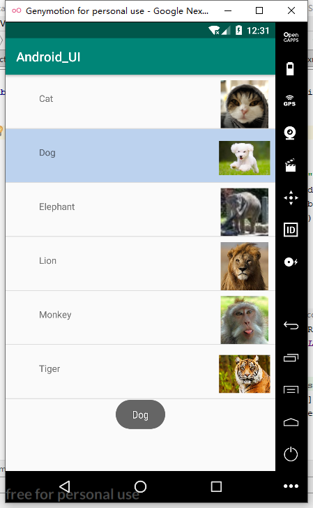
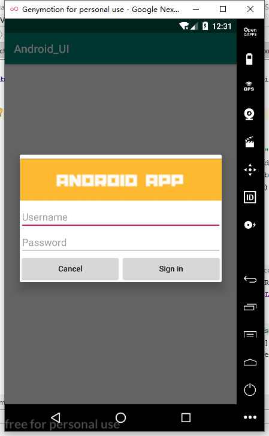
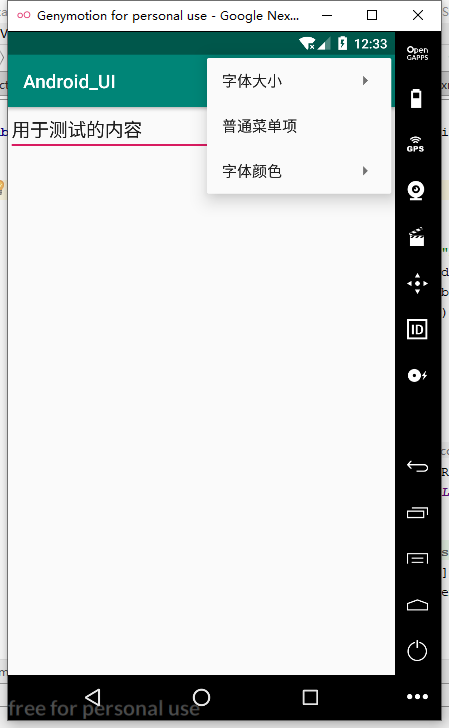
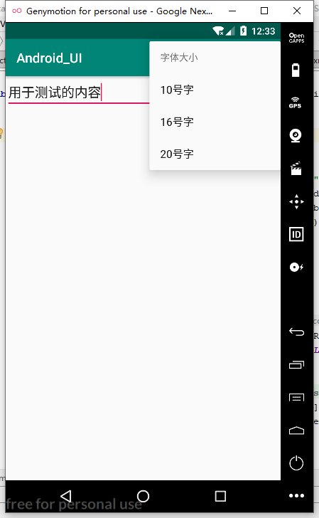
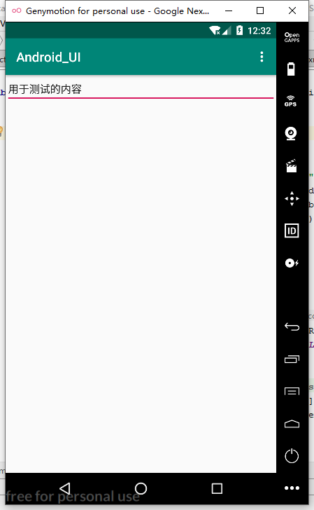
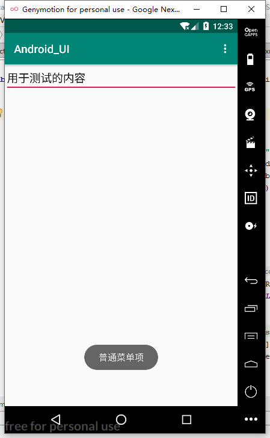
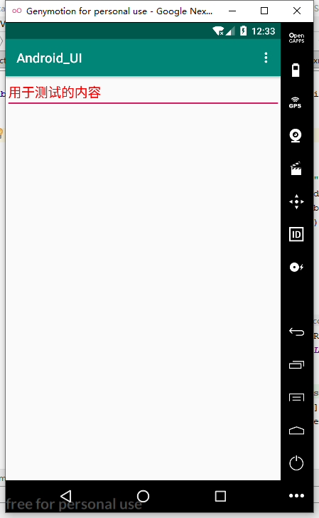
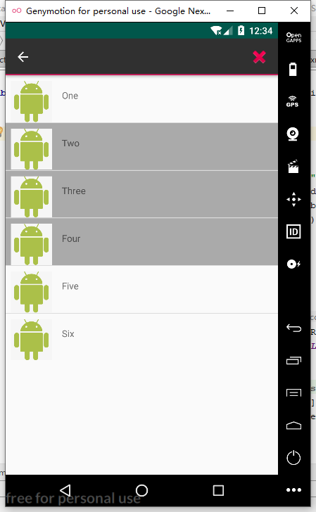

# Read Me

### 程序：Android_UI

#### 一、程序功能
&emsp;&emsp;分别实现SimpleAdapter、AlertDialog、XML定义菜单、ActionMode
#### 二、代码实现
##### SimpleAdapter  
实现类似聊天界面的效果  
分别有一个ListView和一个单个条目的布局,再由activity实现  
ListView：
```
<ListView
        android:id="@+id/List"
        android:layout_width="match_parent"
        android:layout_height="match_parent"
        android:listSelector="@color/blue">
    </ListView>

```
单个条目的布局  simpleadapter_item_layout:
```
<ImageView
        android:id="@+id/picture"
        android:layout_width="0dp"
        android:layout_height="73dp"
        android:layout_marginTop="8dp"
        android:layout_marginEnd="8dp"
        app:layout_constraintEnd_toEndOf="parent"
        app:layout_constraintStart_toEndOf="@+id/name"
        app:layout_constraintTop_toTopOf="parent"
        app:srcCompat="@drawable/cat" />

    <TextView
        android:id="@+id/name"
        android:layout_width="0dp"
        android:layout_height="39dp"
        android:layout_marginStart="51dp"
        android:layout_marginTop="26dp"
        android:layout_marginEnd="197dp"
        android:text="TextView"
        app:layout_constraintEnd_toStartOf="@+id/picture"
        app:layout_constraintStart_toStartOf="parent"
        app:layout_constraintTop_toTopOf="parent" />
```
activity的实现 SimpleAdapterActivity：
```
final String[] picture_name = new String[]{"Cat","Dog","Elephant","Lion","Monkey","Tiger"};
        final int[] picture = new int[]{R.drawable.cat,R.drawable.dog,R.drawable.elephant,
                R.drawable.lion,R.drawable.monkey,R.drawable.tiger};
        List<Map<String,Object>> list = new ArrayList<Map<String,Object>>();
        for(int i=0;i<picture_name.length;i++){
            Map<String,Object> item = new HashMap<String,Object>();
            item.put("name",picture_name[i]);
            item.put("picture",picture[i]);
            list.add(item);
        }
        SimpleAdapter simpleAdapter = new SimpleAdapter(this,list,R.layout.simpleadapter_item_layout,
                new String[]{"name","picture"},new int[]{R.id.name,R.id.picture});
        ListView listView = (ListView) findViewById(R.id.List);
        listView.setAdapter(simpleAdapter);

        listView.setOnItemClickListener(new AdapterView.OnItemClickListener() {
            @Override
            public void onItemClick(AdapterView<?> parent, View view, int position, long id) {
                CharSequence item = picture_name[position];
                Toast.makeText(getApplicationContext(),item,Toast.LENGTH_LONG).show();
            }
        });
```
效果如下：
  

##### AlertDialog
实现一个登陆对话框  
实现了一个登录框的布局，然后在activity里调用  
线性布局实现dialog_login_layout：
```
<LinearLayout
    xmlns:android="http://schemas.android.com/apk/res/android" android:layout_width="match_parent"
    android:layout_height="match_parent"
    android:orientation="vertical">
    <ImageView
        android:layout_width="match_parent"
        android:layout_height="wrap_content"
        android:src="@drawable/header_logo"/>
    <EditText
        android:id="@+id/Username"
        android:layout_width="match_parent"
        android:layout_height="wrap_content"
        android:hint="Username"/>

    <EditText
        android:id="@+id/Password"
        android:layout_width="match_parent"
        android:layout_height="wrap_content"
        android:hint="Password"/>
    <LinearLayout
        android:layout_width="match_parent"
        android:layout_height="match_parent"
        android:orientation="horizontal">
        <Button
            android:id="@+id/Cancel"
            android:layout_width="0dp"
            android:layout_height="wrap_content"
            android:layout_weight="1"
            android:text="Cancel"
            android:textAllCaps="false"/>
        <Button
            android:id="@+id/Signin"
            android:layout_width="0dp"
            android:layout_height="wrap_content"
            android:layout_weight="1"
            android:text="Sign in"
            android:textAllCaps="false"/>
    </LinearLayout>
</LinearLayout>
```
activity调用 AlertDialogActivity：
```
final AlertDialog.Builder builder = new AlertDialog.Builder(this);
        final AlertDialog dialog = builder.create();
        View view = View.inflate(this,R.layout.dialog_login_layout,null);

        dialog.setView(view);
        builder.setIcon(R.drawable.header_logo);
        dialog.show();

        Button cancel_button = (Button)view.findViewById(R.id.Cancel);
        Button signin_button = (Button)view.findViewById(R.id.Signin);

        cancel_button.setOnClickListener(new View.OnClickListener() {
            @Override
            public void onClick(View v) {
                dialog.dismiss();
            }
        });
        signin_button.setOnClickListener(new View.OnClickListener() {
            @Override
            public void onClick(View v) {
                dialog.dismiss();
            }
        });
```
运行效果：

##### XML定义菜单
&emsp;&emsp;实现自定义选项菜单，有字体大小、普通菜单项、字体颜色，其中字体大小和字体颜色选项里又有子选项。  
定义菜单项等样式     menu.xml:
```
<menu xmlns:android="http://schemas.android.com/apk/res/android">

    <item
        android:id="@+id/font_size"
        android:icon="@mipmap/ic_launcher"
        android:title="字体大小">
        <menu>
            <item
                android:id="@+id/size_10"
                android:title="10号字"/>
            <item
                android:id="@+id/size_16"
                android:title="16号字"/>
            <item
                android:id="@+id/size_20"
                android:title="20号字"/>
        </menu>
    </item>

    <item
        android:id="@+id/normal_menu"
        android:icon="@mipmap/ic_launcher"
        android:title="普通菜单项"/>


    <item
        android:id="@+id/font_color"
        android:title="字体颜色">
        <menu>
            <item
                android:id="@+id/font_red"
                android:title="红色"/>
            <item
                android:id="@+id/font_black"
                android:title="黑色"/>
        </menu>
    </item>

</menu>
```
实现菜单效果的activity XMLMenuActivity：
```
 private EditText test_text;

    @Override
    protected void onCreate(Bundle savedInstanceState) {
        super.onCreate(savedInstanceState);
        setContentView(R.layout.activity_xmlmenu);
        test_text = (EditText)findViewById(R.id.test_text);
    }

    @Override
    public boolean onCreateOptionsMenu(Menu menu) {
        getMenuInflater().inflate(R.menu.menu,menu);
        return super.onCreateOptionsMenu(menu);
    }

    @Override
    public boolean onOptionsItemSelected(MenuItem item) {
        switch (item.getItemId()){
            case R.id.size_10:
                test_text.setTextSize(10);
                break;
            case R.id.size_16:
                test_text.setTextSize(16);
                break;
            case R.id.size_20:
                test_text.setTextSize(20);
                break;
            case R.id.normal_menu:
                Toast.makeText(this,"普通菜单项",Toast.LENGTH_LONG).show();
                break;
            case R.id.font_red:
                test_text.setTextColor(Color.RED);
                break;
            case R.id.font_black:
                test_text.setTextColor(Color.BLACK);
                break;
        }
        return super.onOptionsItemSelected(item);
    }
```
运行效果：  

菜单选项：  
  
点击字体大小：  
  
点击16号字：  
  
点击普通菜单项：  
  
点击字体颜色：选择红色  

##### ActionMode
实现上下文操作模式，长按一项可以多选  
先实现界面，类似实现SimpleAdapter，activity里实现上下文操作模式  
ActionModeActivity：
```
listView.setChoiceMode(ListView.CHOICE_MODE_MULTIPLE_MODAL);
        listView.setMultiChoiceModeListener(new AbsListView.MultiChoiceModeListener() {
            @Override
            public void onItemCheckedStateChanged(ActionMode mode, int position, long id, boolean checked) {

            }

            @Override
            public boolean onCreateActionMode(ActionMode mode, Menu menu) {
                MenuInflater inflater = mode.getMenuInflater();
                inflater.inflate(R.menu.actionmode_menu, menu);
                return true;
            }

            @Override
            public boolean onPrepareActionMode(ActionMode mode, Menu menu) {
                return false;
            }

            @Override
            public boolean onActionItemClicked(ActionMode mode, MenuItem item) {
                switch (item.getItemId()) {
                    case R.id.menu_item_delete_crime:

                        mode.finish(); // Action picked, so close the CAB
                        return true;
                    default:
                        return false;
                }
            }

            @Override
            public void onDestroyActionMode(ActionMode mode) {

            }
        });
    }
```
运行效果：

